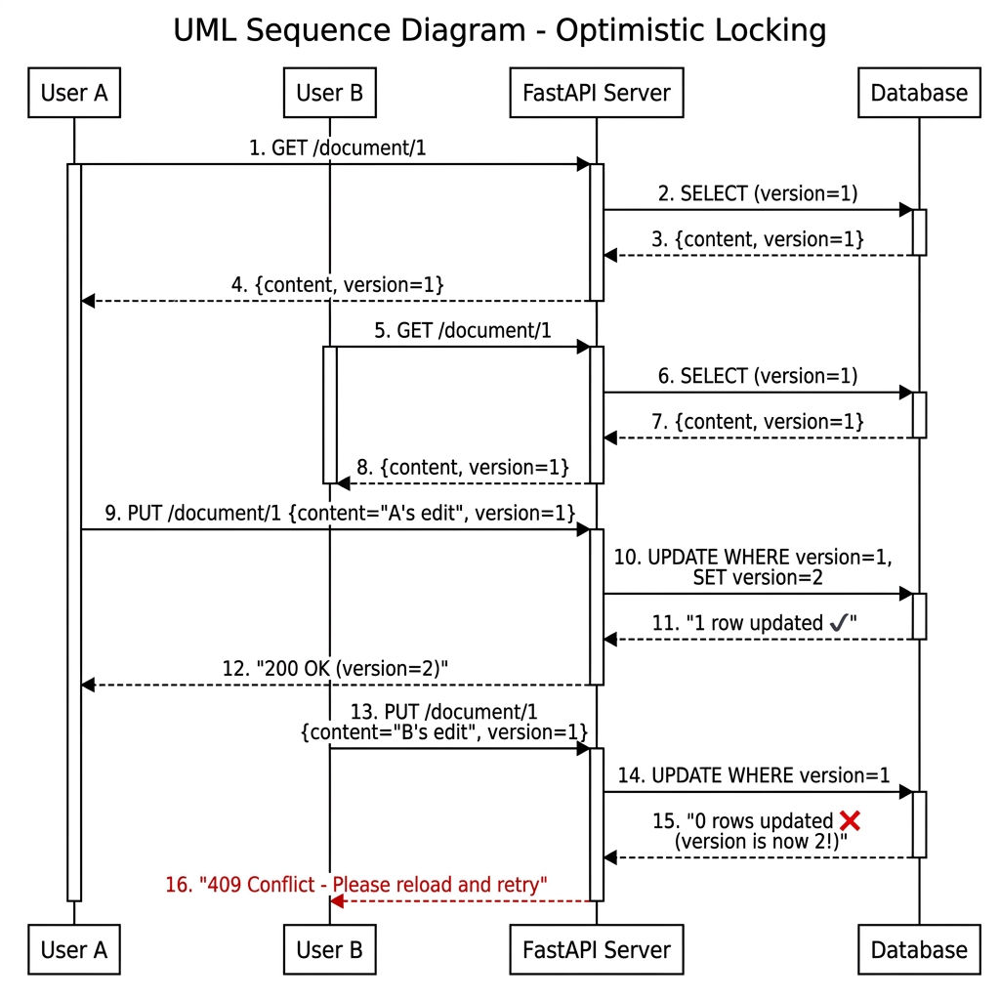

**Mohammad Abdullah — BSCS23202**
---

## Part 1: Analyze the Mess

### The Synchronization Failure
The database synchronization problems stem from the race condition in the Read Modify Write sequence, often referred to as the Lost Update problem. In the API pipeline, the concurrent users who read the same document get the same snapshot of the initial state. Upon sending their updates, the backend executes these update operations one after the other. As the system uses the simplistic "last writer wins" approach without checking whether the document has been modified from its reading time, the last update operation automatically overrides all previous updates. This happens particularly during the db.commit() process, whereby the database’s “Read Committed” isolation level blindly accepts the conflicting updates without any concurrency control mechanisms in place at the application layer.

### The Coordination Failure
The current design implements Clerk webhook handling via the fire-and-forget pattern, which does not offer any resilience. When Clerk sends us an event that shows that a particular user has decided to cancel their subscription, we receive it right away and try to handle it. In case we experience a network error or our server fails to accept the event for whatever reason, it will be lost forever because we have no way to confirm its reception or request redelivery of the event. It results in our internal database being out of sync because our system knows that the user canceled their premium account while our database still thinks otherwise.

### The Fault Tolerance Failure
Dependency on the LLM API makes this system vulnerable to failure caused by a single point of failure because the calls to this API happen synchronously using HTTP. When calling the `generate_challenge_with_ai()` method on the Gemini API, it doesn't have any timeout parameters for its request; thus, it relies on the socket timeout by default. Since the FastAPI runs on a single-threaded asyncio event loop, it is possible for this function to block the entire thread while waiting for a response from the API.

---

## Part 2: Design a Better System

### Optimistic Locking for Concurrent Edits
To solve the Lost Update problem, we can employ Optimistic Locking through the implementation of version numbers. We will have a `version` column, which is of type INTEGER, added to our documents table. On reading a document, the client gets back the version number of that document at that time. While updating the document, the client should include the version number while making the request. Then, we modify the `UPDATE` query by adding the `WHERE id = ? AND version = current_version` condition. If a different user has updated the document, there won’t be any row changed since the `version` value would be different from the current version.

#### UML Sequence Diagram — Two Concurrent Users

### Fault-Tolerant Webhook Handler
In order to prevent webhook events from getting lost forever, it is imperative that we design a resilient handler that can deal with both idempotency and guaranteed delivery. Firstly, we will introduce an idempotency key concept and store the ID for each event that we process inside a table in the database. The application will first check for the existence of this ID before proceeding with the business logic for the event and if found, simply ignore it without performing any operation, thus eliminating the problem of retries. In order to solve the problem of dropped events, we can set Clerk to perform an exponential backoff on each failed attempt.
### Circuit Breaker with Fallback
To address the synchronous LLM bottleneck problem, we will be using a Circuit Breaker design pattern. Essentially, this pattern is a stateful proxy of the external API in terms of architecture. While in its "Closed" state, requests pass through to the LLM. However, when there are repeated timeouts or failures reaching a certain threshold (for example, 3 failed requests), then the circuit trips to an "Open" state. In the "Open" state, the application automatically fails any requests coming in, replying instantly with a pre-specified fallback challenge without even trying to contact the API. This ensures that the server doesn't get stuck processing requests indefinitely. After waiting out a certain amount of time after that, the circuit goes into a "Half-Open" state, where one request is issued to test the availability of the LLM, and depending on the results either resets or trips open.
### CAP Theorem Trade-offs
In addressing these distributed system challenges, our architecture explicitly navigates the trade-offs defined by the CAP theorem. For our consumer-facing application, we primarily prioritize Availability and Partition Tolerance (AP) over strict Consistency. The webhook reconciliation strategy embraces eventual consistency; we accept that there may be a temporary window where our local database is out of sync with Clerk's truth, favoring the system's continued operation during network partitions. Similarly, the Circuit Breaker pattern intentionally trades consistency (serving a static, potentially stale fallback challenge) to maintain high availability and prevent cascading failures. 

However, for document synchronization, we lean towards Consistency by rejecting conflicting writes with a 409 status, recognizing that data integrity in user documents supersedes the availability of a successful save operation in that specific context. Furthermore, acknowledging the PACELC theorem, our Circuit Breaker specifically trades consistency for reduced latency during normal operations, ensuring the system remains highly responsive rather than hanging indefinitely when the LLM degrades.

---

> **Part 3 Implementation:** The Circuit Breaker pattern is implemented in `backend/src/circuit_breaker.py`, `backend/src/ai_generator.py`, and demonstrated in `backend/demo_fault_tolerance.py`.
