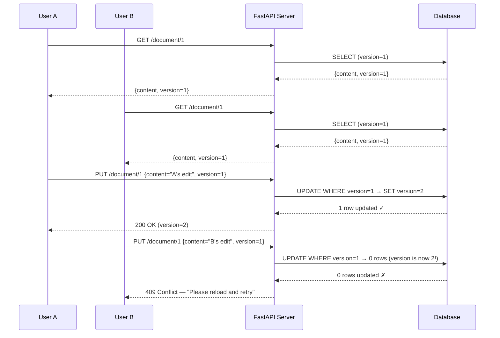

# StudySync: Building Resilient Distributed Systems
**Mohammad Abdullah — BSCS23202**
**Course:** Parallel and Distributed Computing (PDC)

---

## Part 1: Analysis — Why StudySync is Crashing (20 pts)

### Problem 1: Lost Update Anomaly (Synchronization)

The root cause is a **Read-Modify-Write race condition** in the database layer. When two users load the same shared document, each receives an identical snapshot. Both modify their local copy and issue an `UPDATE` statement. The second `UPDATE` silently overwrites the first because the application performs no version checking — it uses a **last-writer-wins** strategy by default. SQLite/PostgreSQL will happily execute both writes sequentially with no conflict detection. The `db.commit()` call in the CRUD layer (see `db.py`) has no Optimistic Concurrency Control (OCC) mechanism — there is no `WHERE version = ?` guard, and no `@version` column exists on the model. This is the textbook **Lost Update** anomaly: a direct consequence of running at the Read Committed isolation level without application-level safeguards.

### Problem 2: Dropped Webhook (Coordination)

Clerk fires a webhook to our `/webhooks/clerk` endpoint when a user's subscription status changes. The current handler (`webhooks.py`) is **fire-and-forget from Clerk's perspective**: if the network drops the HTTP request, or if our server returns a 5xx error, the cancellation event is permanently lost. There is no idempotency key stored in our database to deduplicate retries, no dead-letter queue to capture failed events, and no periodic reconciliation job that polls Clerk's API to verify state. The systems become **permanently inconsistent** — Clerk marks the user as cancelled, but our database never receives the update. This violates the fundamental coordination principle that distributed state changes must be **at-least-once** delivered and **idempotently** processed.

### Problem 3: Synchronous LLM Blocking (Fault Tolerance)

The `generate_challenge_with_ai()` function in `ai_generator.py` makes a **synchronous HTTP call** to the external Gemini API. This call has no explicit timeout. When the API is overloaded or unreachable, the default socket timeout of 60+ seconds applies. Because this synchronous call runs inside an `async def` FastAPI handler, it **blocks the entire event loop thread**. FastAPI/Uvicorn typically runs on a single-threaded asyncio loop — one blocked call means zero requests can be processed. The external LLM becomes a **single point of failure (SPOF)**: one slow dependency takes down the entire application for all 1,000 users.

---

## Part 2: Architectural Solutions (30 pts)

### Solution 1: Optimistic Locking for Concurrent Edits

**Approach:** Add a `version` integer column to the document model. Every `UPDATE` includes a `WHERE version = current_version` clause. If zero rows are affected, the update is rejected with a 409 Conflict response, prompting the client to reload and retry.

**Implementation Sketch:**
```python
# Model
class Document(Base):
    id = Column(Integer, primary_key=True)
    content = Column(Text)
    version = Column(Integer, default=1, nullable=False)

# Update logic
def update_document(db, doc_id, new_content, expected_version):
    rows = db.query(Document).filter(
        Document.id == doc_id,
        Document.version == expected_version
    ).update({
        "content": new_content,
        "version": expected_version + 1
    })
    if rows == 0:
        raise HTTPException(409, "Conflict: document was modified")
    db.commit()
```

#### UML Sequence Diagram — Two Concurrent Users



### Solution 2: Fault-Tolerant Webhook Handler

**Approach:** Implement three layers of defense:

1. **Idempotency Keys:** Store every processed webhook event ID in a `processed_webhooks` table. Before processing, check if the event ID already exists. This makes retries safe — processing the same event twice is a no-op.

2. **Retry with Exponential Backoff:** Configure Clerk (or a middleware proxy) to retry failed webhook deliveries with exponential backoff (e.g., 1s, 2s, 4s, 8s, up to 5 retries). Our endpoint returns 200 only after successful processing.

3. **Reconciliation Cron Job:** Run a periodic job (every 15 minutes) that queries Clerk's API for all subscription statuses and reconciles them against our database. This catches any events that were permanently lost despite retries.

```
Clerk → [Webhook + Retry] → Backend → Check Idempotency Table
                                         ├── Already processed? → 200 OK (skip)
                                         └── New event? → Process → Store ID → 200 OK
                            [Cron Job] → Poll Clerk API → Reconcile DB
```

### Solution 3: Circuit Breaker with Fallback (Implemented in Part 3)

**Approach:** Wrap the LLM API call in a **Circuit Breaker** (inspired by Netflix Hystrix):

| State | Behavior |
|---|---|
| **CLOSED** | Requests pass through normally. Failures are counted. |
| **OPEN** | After 3 consecutive failures, all requests are immediately short-circuited to a fallback response. No API calls are attempted. |
| **HALF_OPEN** | After a 30-second recovery timeout, one probe request is allowed through. If it succeeds → CLOSED. If it fails → OPEN again. |

Additionally, each API call is wrapped with a **10-second hard timeout** using `concurrent.futures.ThreadPoolExecutor`, preventing indefinite blocking.

### CAP Theorem Trade-offs

Our solutions prioritize **Availability** and **Partition Tolerance** (AP) over strong Consistency:

| Solution | Trade-off |
|---|---|
| **Optimistic Locking** | Slightly sacrifices availability (409 rejections) to gain consistency. This is a rare CA lean within our mostly-AP system. |
| **Webhook Reconciliation** | Accepts **eventual consistency** — there may be a window (up to 15 minutes) where our DB is stale. We trade immediate consistency for availability and partition tolerance. |
| **Circuit Breaker** | Explicitly trades consistency (stale fallback content) for availability. When the LLM is down, users still get *a* response, just not a fresh one. The system stays available under network partitions. |

Per the CAP theorem, in a distributed system experiencing a network partition, we must choose between Consistency and Availability. Since StudySync is a consumer-facing application where **uptime is critical**, we favor availability. Temporary staleness (serving a cached/fallback challenge) is far more acceptable than a complete outage.

The key insight is that **latency is the hidden CAP dimension** (as argued by the PACELC theorem): even without partitions, we face an Else-Latency-vs-Consistency trade-off. The circuit breaker reduces latency at the cost of consistency — returning a fallback in 0.001s instead of waiting 60s for fresh content.

---

> **Part 3 Implementation:** Circuit Breaker pattern — see `backend/src/circuit_breaker.py`, `backend/src/ai_generator.py`, and `backend/demo_fault_tolerance.py`.
